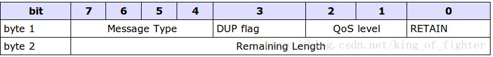
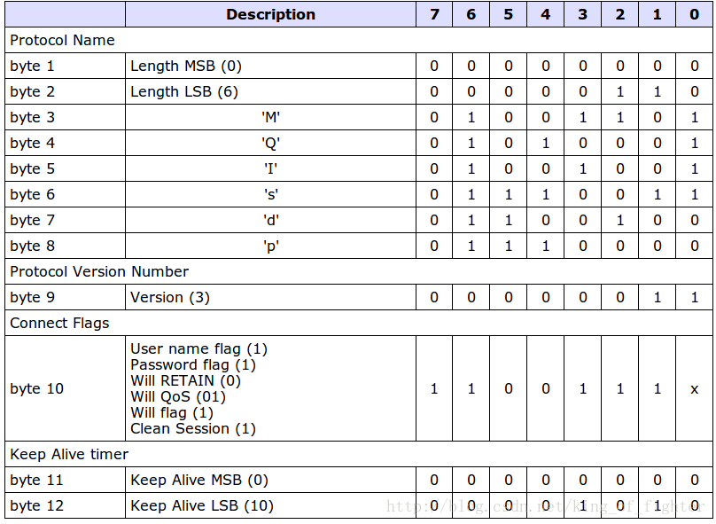
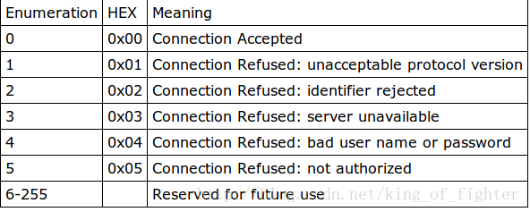

## MQTT协议详解一

 					2013年01月22日 					 ⁄ 综合 										⁄ 共 3857字					⁄ 字号 [小](javascript:doZoom(12)) [中](javascript:doZoom(13)) [大](javascript:doZoom(18)) 					 ⁄ 评论关闭 										 				

首先给出MQTT协议的查看地址：<http://public.dhe.ibm.com/software/dw/webservices/ws-mqtt/mqtt-v3r1.html>

当然也有PDF版的，百度一下，不过个人感觉不是官网上的字体和排版最舒服。

那么这个协议是用做什么或有什么特色呢？下面是mqtt.org上的首段介绍：

*It  was designed as an extremely lightweight publish/subscribe messaging  transport. It is useful for connections with remote locations where a  small code footprint is  required and/or network bandwidth is at a premium. For example, it has  been used in sensors communicating to a broker via satellite link, over  occasional dial-up connections with healthcare providers, and in a range  of home automation and small device scenarios.  It is also ideal for mobile applications because of its small size, low  power usage, minimised data packets, and efficient distribution of  information to one or many receivers*

**MQTT**是轻量级*基于代理的***发布/订阅***的消息传输协议*，它可以通过很少的代码和带宽和远程设备连接。例如通过卫星和代理连接，通过拨号和医疗保健提供者连接，以及在一些自动化或小型设备上，而且由于小巧，省电，协议开销小和能高效的向一和多个接收者传递信息，故同样适用于称动应用设备上。

相信在想深入学习这协议必是奔着解决某个问题而来的，上面给出了适用的场景，我之所以想深入的学习和了解这个协议，理由如下：

1、可以实现手机消息推送（PUSH）

2、协议简单，最小的头部只需2个字节，特别适合于嵌入式中。

3、这是个了解什么是协议绝好的例子。相比于其它复杂的协议例如tcp，http协议，至少说明文档看的下去。

在这里，我以推送为例子说明，虽然现在现成的推送解决方案已经比较成熟，但是这个Repeat ReInvent the Whell还是要做一下，什么都是拿来主义，和搬运工有什么区别。

**一、需要的环境：**

1、PHP+Apache或Nginx

2、安装开源代理程序Mosquitto，这里用其做为代理服务器，负责连接和分发。

安装方法很简单，<http://mosquitto.org/files/>   binary是编译好的，source是源码安装需要的（make & make install 就行）

唯 一要配置的就是在解压后的config.mk,安装完后设置文件是mosquitto.conf

当然主要是设置是否支持ssl，还有就是config.mk最下面的安装位置的设定。这里一切默认。

默认启动是绑定的IP是本地IP，端口是1883可以在mosquitto.conf里设置（要去掉前面的#字注释），linux 中 -c 可以指定设置文件并运行

比 如： mosquitto -c /etc/mosquitto.conf

**二、协议初解**

先说一下整个协议的构造，整体上协议可拆分为：

​                    **固定头部+可变头部+消息体**

协议说白了就是对于双方通信的一个约定，比如传过来一段字符流，第1个字节表示什么，第2个字节表示什么。。。。一个约定。

## 固定头部

所以在固定头部的构造如下：



1、MessageType(0和15保留，共占4个字节)

```java
public $operations=array(
         "MQTT_CONNECT"=>1,//请求连接>>>>>>有消息体
         "MQTT_CONNACK"=>2,//请求应答
         "MQTT_PUBLISH"=>3,//发布消息>>>>>>>>>是有消息体的三种类型(的消息体中的)所推送的消息内容
         "MQTT_PUBACK"=>4,//发布应答>>>>>>QoS1的publish报文响应
         "MQTT_PUBREC"=>5,//发布已接收，保证传递1>>>>>>QoS2的publish报文响应
         "MQTT_PUBREL"=>6,//发布释放，保证传递2
         "MQTT_PUBCOMP"=>7,//发布完成，保证传递3
         "MQTT_SUBSCRIBE"=>8,//订阅请求>>>>>>有消息体
         "MQTT_SUBACK"=>9,//订阅应答>>>>>>有消息体
         "MQTT_UNSUBSCRIBE"=>10,//取消订阅
         "MQTT_UNSUBACK"=>11,//取消订阅应答
         "MQTT_PINGREQ"=>12,//ping请求
         "MQTT_PINGRESP"=>13,//ping响应
         "MQTT_DISCONNECT"=>14//断开连接
        ); 
```

```java
CONNECT
TCP连接建立完毕后，Client向Server发出一个Request。
如果一段时间内接收不到Server的Response，则关闭socket，重新建立一个session连接。
如果一个ClientID已经与服务器连接，则持有同样ClientID的旧有连接必须由服务器关闭后，新建立才能建立。
 
CONNACK
Server发出Response响应。
0x00 Connection Accepted
0x01 Connection Refused: unacceptable protocol version
0x02 Connection Refused: identifier rejected
0x03 Connection Refused: server unavailable
0x04 Connection Refused: bad user name or password
0x05 Connection Refused: not authorized
 
PUBLISH 发布消息
Client/Servier均可以进行PUBLISH。
publish message 应该包含一个TopicName(Subject/Channel)，即订阅关键词。
 
关于Topic通配符
/：用来表示层次，比如a/b，a/b/c。
#：表示匹配>=0个层次，比如a/#就匹配a/，a/b，a/b/c。
单独的一个#表示匹配所有。
不允许 a#和a/#/c。
+：表示匹配一个层次，例如a/+匹配a/b，a/c，不匹配a/b/c。
单独的一个+是允许的，a+不允许，a/+/b不允许
 
PUBACK 发布消息后的确认
QoS=1时，Server向Client发布该确认（Client收到确认后删除），订阅者向Server发布确认。
 
PUBREC / PUBREL / PUBCOMP
QoS=2时
1. Server->Client发布PUBREC（已收到）；
2. Client->Server发布PUBREL（已释放）；
3. Server->Client发布PUBCOMP（已完成），Client删除msg；
订阅者也会向Server发布类似过程确认。
 
PINGREQ / PINGRES 心跳
Client有责任发送KeepAliveTime时长告诉给Server。在一个时长内，发送PINGREQ，Server发送PINGRES确认。
Server在1.5个时长内未收到PINGREQ，就断开连接。
Client在1个时长内未收到PINGRES，断开连接。
一般来说，时长设置为几个分钟。最大18hours，0表示一直未断开。
```

2、DUP flag

 其是用来在保证消息传输可靠的，如果设置为1，则在下面的变长头部里多加MessageId,并需要回复确认，保证消息传输完成，但不能用于检测消息重复发送。

3、Qos

主要用于PUBLISH（发布态）消息的，保证消息传递的次数。

00表示最多一次 即<=1

01表示至少一次  即>=1

10表示一次，即==1

11保留后用

4、Retain

 主要用于PUBLISH(发布态)的消息，表示服务器要保留这次推送的信息，如果有新的订阅者出现，就把这消息推送给它。如果不设那么推送至当前订阅的就释放了。

### 5、固定头部的byte 2

是用来保存接下去的`变长头部`+`消息体`的总`大小`的。

但是不是并不是直接保存的，同样也是可以扩展的，其机制是，前7位用于保存长度，后一部用做标识。

我举个例了，即如果计算出后面的大小为0<length<=127的，正常保存

如果是127<length<16383的，则需要二个字节保存了，将第一个字节的最大的一位置1,表示未完。然后第二个字节继续存。

拿130来说，第一个字节存10000011,第二个字节存000000001，也就是0x83,0x01,把两个字节连起来看，第二个字节权重从2的8次开始。

- ```lua
  ftibw注释:每扩展一个字节，新字节单位值得权重为一字节的最大存储值，仅首字节最高位为标志位最多存储127个单位，其他字节均无标志位最多存储255个单位，4字节最多存储127+127*255+127*255*255+127*255*255*255(bit)约等于252mb(1 mb = 8*1024*1024 bit)，近256M的存储量。byte2仍然属于固定头部，但是存储的是[变长头部+消息体]数据的总bit值。
  ```

同起可以加第3个字节，最多可以加至第4个字节。故MQTT协议最多可以实现*268 435 455 (0xFF, 0xFF, 0xFF, 0x7F)将近\**256M**的数据。可谓能伸能缩。*

##  可变头部



这个是可变头部的全貌。

1、首先最上面的8个字节是Protocol Name(编码名)，UTF编码的字符“MQIsdp”，头两个是编码名提长为6。

这里多说一些，接下去的协议多采用这种方式组合，即头两个字节表示下一部分的长，然后后面跟上内容。这里头两个字节长为6，下面跟6个字符“MQIsdp”。

```
ftibw注释:MSB(most significant bit 最高加权位~less significant bit 最低加权位)
```

2、Protocol Version，协议版本号，v3 也是固定的。

3、Connect Flag，连接标识，有点像固定头部的。8位分别代表不同的标志。第1个字节保留。

Clean Session,Will flag，Will Qos, Will Retain都是相对于CONNECT消息来说的。

**Clean Session:**0表示如果订阅的客户机断线了，那么要保存其要推送的消息，如果其重新连接时，则将这些消息推送。

​                            1表示消除，表示客户机是第一次连接，消息所以以前的连接信息。

**Will Flag**，表示如果客户机在不是在发送DISCONNECT消息中断，比如IO错误等，将些置为1,要求重传。并且下次的WillQos和WillRetain也要设置，消息体中的Topic和MessageID也要设置，就是表示发生了错误，要重传。

**Will Qos**，在CONNECT非正常情况下设置，一般如果标识了WillFlag，那么这个位置也要标识。

**Will RETAIN**：同样在CONNECT中，如果标识了WillFlag,那么些位也一定要标识

usename flag和password flag，用来标识是否在消息体中传递用户和密码，只有标识了，消息体中的用户名和密码才用效，只标记密码而不标记用户名是不合法的。

4、**Keep Alive**，表示响应时间，如果这个时间内，连接或发送操作未完成，则断开tcp连接，表示离线。

**5、Connect Return Code**即通常于CONNACK消息中，表示返回的连接情况，我可以通过此检验连接情况。



**6、Topic Name，**订阅消息标识，MQTT是基于订阅/发布的消息，那么这个就是消息订阅的标识，像新闻客户端里的订阅不同的栏目一样。用于区别消息的推送类别。

主要用于PUBLISH和SUBSCRIBE中。最大可支持**32767个**字符**(这里到底是字符还是bit)**，即4个字节。

## 消息体（PayLoad）

只有3种消息有消息体**CONNECT，SUBSCRIBE，SUBACK**

**CONNECT**主要是客户机的ClientID，订阅的Topic和Message以及用户名和密码，与变长头部中的will是对应的。

**SUBSCRIBE**是包含了一系列的要订阅的主题以及QOS。

**SUBACK**是用服务器对于SUBSCRIBE所申请的主题及QOS进行确认和回复。

而**PUBLISH**是消息体中则保存推送的消息，以二进制形式，当然这里的编辑可自定义。

**7、Message Identifier**

包含于**PUBLISH, PUBACK, PUBREC, PUBREL, PUBCOMP, SUBSCRIBE, SUBACK, UNSUBSCRIBE, UNSUBACK.**

*其为16位字符表示，用于在Qos为1或2时标识Message的，保证Message传输的可靠性。*

*至于具体的消息例子，我们在后面的代码中慢慢体现。*